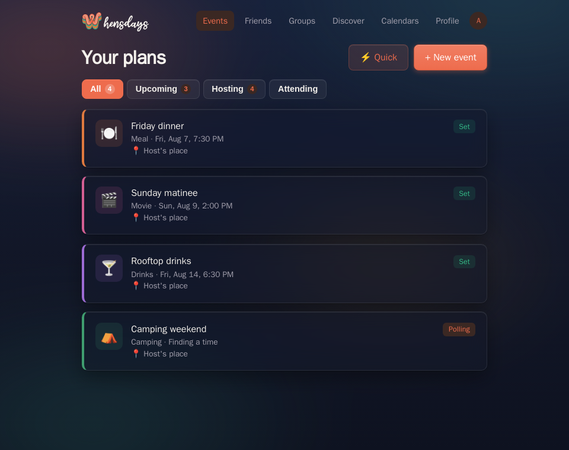
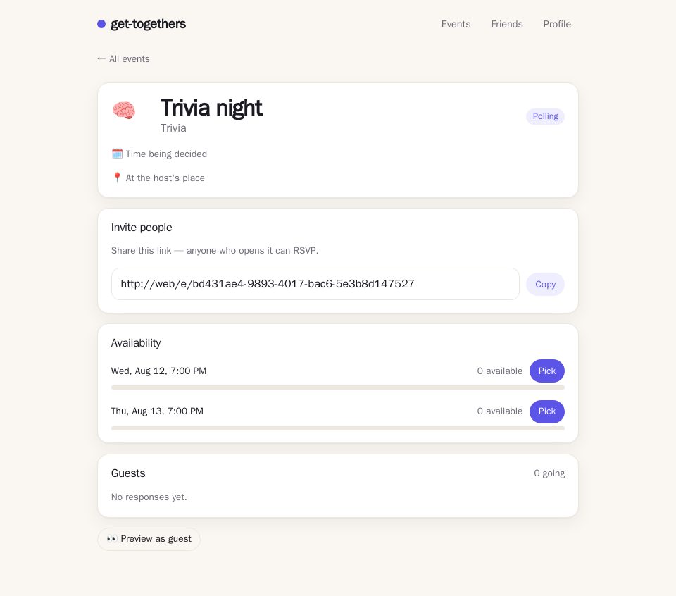
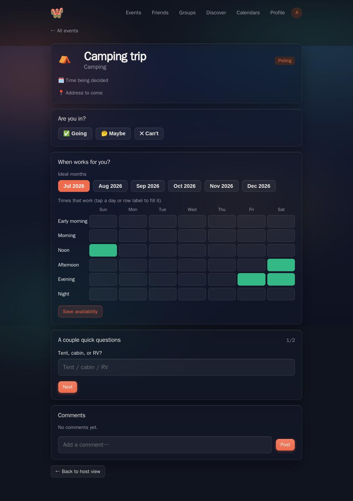

# Whensdays (clSandbox app)

**Plans, minus the group-chat chaos.** A minimal scheduling assistant for any
get-together — dinner, drinks, movie night, camping, trips, parties. Host an event at
your place or get help finding a venue, set a time or let everyone vote on
availability, answer a couple of quick preference questions tuned to the event
type, add friends, and see when they're free.

Built on the **clSandbox** template — **React + Go + Postgres**, containerized
end to end, where every feature ships with a visual end-to-end test. Secure,
fast, scalable, and cheap to host. This app lives on the `app/scheduler` branch.

> **Maintenance rule:** every code change must check this README. If behavior, features, routes, ports, or setup change, update the relevant section in the same commit. See [Keeping this README current](#keeping-this-readme-current).

## Product direction (read before adding features)

**Wedge:** recurring coordination for small friend groups & clubs (book clubs, run groups, D&D tables, monthly dinners, annual trips) — not one-off parties (Partiful) or work polls (Doodle).

Priorities, in order — growth loop over feature breadth:
1. **Frictionless guests** — invitees must be able to RSVP/vote/comment from the invite link *without creating an account* (capability link + name; convert later). The signup wall is the #1 conversion killer.
2. **Notifications** — transactional email (invite, votes, time locked, reminder, new comment). No nudges = no retention.
3. **Calendar as moat** — imported busy times should auto-block availability and rank candidate times, not just display.
4. **Recurring groups** — series events + a persistent group home (drives retention structurally).
5. **Monetize via intent, not walls** — affiliate/commerce on event types (dinner→reservation, trip→lodging), organizer premium later. Never paywall basics.

Measure in PostHog: activation (host invites ≥1), invite→participant conversion, participant→new-host (K-factor), events/group/month, W4 retention. **Feature breadth is not a moat — defer new event types/polish until the loop works.**

**Roadmap (updated 2026-07-06).** The original priority list and Phases 2–3 are **shipped**; what remains is launch and retention work:

- **Now — launch:** deploy for real (Cloud Run + Cloudflare Pages + Neon per `docs/DEPLOY.md`), turn on live Clerk auth, production Klipy key (the test key is 100 calls/hr), seed the first real groups (initial audience: improv/stand-up/sketch/theater locals — the show/practice/open-mic types + Comedy & performance category exist for this).
- **Next — retention:** guest→account merge (Clerk sign-up should adopt the guest's plans, not orphan them), smarter time suggestions (rank poll options against ALL attendees' availability + imported calendars, not just the viewer's), series editing (change one vs all occurrences), public-event moderation basics (report/hide) before pushing Discover harder.
- **Later:** organizer premium (never paywall basics), deeper intent/affiliate links, per-user live `.ics` feed subscriptions, localization.

Shipped, mapped to the original phases:
1. ✅ **Frictionless guests** — no-account RSVP/vote/comment via the invite link; guests can host ("Start a plan"); Sign-up conversion CTA.
2. ✅ **Notifications** — transactional email (invites, finalize, comments, reminders) + in-app badges.
3. ✅ **Calendar** — import (Google OAuth / Apple iCal) blocks availability + flags poll conflicts; one-tap export (Apple/Google/.ics with a link back).
4. ✅ **Recurring groups** — groups with icons/members, recurring series events, group event lists.
5. ✅ **Growth surfaces** (was Phases 2–3) — OG unfurls with a branded card, Web Share, PWA, quick-create, code-split bundle, public Discover + ranked For-you feed with follows, event covers (photo/Klipy GIF) + backdrop themes, avatar-stack social proof on tiles.


---

## Run it (only Docker required)

Nothing needs to be installed on your machine except Docker.

```bash
docker compose -f compose.demo.yaml up --build -d
```

Then open **http://localhost:8080**.

This runs the full stack — Postgres + Go API + React web (behind nginx) — in **dev auth mode**, so no Clerk account is needed to click around. The API self-applies its database schema on boot.

Stop it:

```bash
docker compose -f compose.demo.yaml down        # keep data
docker compose -f compose.demo.yaml down -v     # wipe the database too
```

### Other ways to run

| Goal | Command | Notes |
|---|---|---|
| Manual navigation | `docker compose -f compose.demo.yaml up --build -d` | http://localhost:8080, no Clerk |
| Full E2E in containers | `make e2e-docker` | builds stack + runs visual tests, exits 0 on pass |
| Hot-reload dev (native) | `make dev` | needs Go + Node + pnpm; uses real Clerk |
| Production-shaped stack | `make up` | real Clerk; see `docs/DEPLOY.md` |

The end-to-end tests and their latest results are documented in **[E2E.md](E2E.md)**.

**Testing with two users (dev mode):** open the app with `?as=<name>` to act as that
user (the API trusts an `X-Dev-User` header in dev). The id is stored per browser
tab, so two tabs can be two people at once — e.g. visit `http://localhost:8080/?as=alice`
in one tab and `?as=bob` in another to test friend requests, invites, and RSVPs.

---

## Features (manual navigation guide)

Open **http://localhost:8080**. In dev mode you're automatically acting as the user `demo-user` (no sign-in screen).

> Screenshots below are generated automatically from the live app with `make docs-shots` — see [Keeping this README current](#keeping-this-readme-current).

### Your plans — the dashboard

The home page lists what you're hosting and what you've been invited to, with a
**+ New event** button. First visit asks only for a name and a handle.



### An event — host view

Each event has a shareable invite link, an availability poll (when the time
isn't fixed), the guest list, and a summary of everyone's preferences. Tap
**👀 Preview as guest** to see exactly what invitees see.



### General availability — pick times per day

A general poll is scoped by the host: **this week** (guests tap a grid of the next
7 concrete dates × times of day), **this month** (guests tap the days that work over
the next 4 weeks), or **generally** (ideal months + a weekday × time-of-day grid,
fill a row/column from its header). The host sees a matching heatmap or day ranking.



| Feature | Where | How to use it | Under the hood |
|---|---|---|---|
| **Profile** | First run / **Profile** | Set a display name + unique handle, a **profile photo**, and your **availability** — either a **recurring weekly** pattern (weekday × morning/afternoon/evening) or **specific dates** (paginated two weeks at a time, up to ~12 weeks ahead). The grid is **tri-state** — **green = free, red = busy, blank = not set** (a legend explains it) — with a **Free / Busy** brush toggle so a tap (or a row/column header fill) paints either state; imported-calendar conflicts are locked (hatched) | `PUT /api/profile`, `PUT /api/profile/avatar`, `PUT /api/availability` (weekly), `PUT /api/availability/days` (dates) — each cell carries a `status`, scoped to your user |
| **See friends' availability** | **Friends** | Open an accepted friend to see their real upcoming free dates/times (+ what they're booked for) | `GET /api/friends/{id}/availability` |
| **Who's coming + add friends** | Event page | A clear **RSVP-grouped guest list** (Going / Maybe / Can't go); any real (non-guest) attendee who isn't already your friend gets a **+ Add friend** button right there | `GET /api/events/{id}` (attendees carry `handle`), `POST /api/friends` |
| **Address autocomplete + directions** | New/Edit event | The location field has **free type-ahead** (OpenStreetMap via Photon — no key, no billing); on the event page the address shows **both a Google Maps and an Apple Maps link** (no universal "default map app" URL exists across platforms, so both are offered) | `GET /api/geo/search` (server-proxied); `google.com/maps` + `maps.apple.com` links |
| **Create an event** | **+ New event** | Title, type (dinner/drinks/movie/camping/party/trip/**show/practice/open mic**/other — plus **custom types** you save and can delete via their ✕), location (your place + address *or* "help me find a venue"), and one of three scheduling modes (below) | `POST /api/events` (+ time options for specific-time polls); `DELETE /api/event-types/{label}` |
| **Your plans** | Home | A filter row (**All / Upcoming / Hosting / Attending**, with counts) narrows the event list; **NEW** badges on events you haven't opened; each tile shows a **who's-going avatar stack** (friends first — accent ring — then people with photos, then initials) with a **+N more** tail | `GET /api/events` (returns `unseen` ids + per-event `faces`) |
| **Dark / light theme** | Profile → Appearance | Dark by default; toggle to light (persisted, no-flash). Both themes are **glass panels over a slowly drifting CSS sky** — dusk (dark) or open day sky (light); no image assets, respects reduced-motion | client-only, `data-theme` on `<html>`, design tokens in `styles.css` |
| **Guest keeps their plans** | Sign up after using it as a guest | Everything a guest did — hosted events, RSVPs, comments — follows them into the new account; their name is prefilled | `POST /api/guest/merge` (transactional reassign) |
| **Account settings** | Profile (signed in) | Our own card: primary email, change email (verification code), sign out — not Clerk's widget | `ClerkAccount.tsx` via Clerk hooks |
| **See who picked what** | General-availability event (host) | A row of responder avatars; tap one to highlight exactly the times/days that person chose | `GeneralResults` overlays each user's `general_votes` |
| **Rich link previews** | Any shared invite | Texting an invite link unfurls a **per-event card**: the event's cover photo/GIF as the big tile, the **host's name top-left** ("… invites you") and the **logo top-right**; cover-less events get a branded gradient card with the title. Composited server-side in Go (`/api/events/{id}/og.png`) | `handleOGPage` (`ogpage.go`) + `apps/web/public/og-card.png` |
| **RSVP** | Event page | Going / Maybe / Can't | `POST /api/events/{id}/rsvp` |
| **Scheduling — fixed time** | New event → "I'll set a time" | Host sets the date/time up front | `scheduling_mode: "fixed"` |
| **Scheduling — specific-times poll** | Event page (poll events) | Guests vote 👍/🤷/👎 on each proposed time; host **Picks** one to lock it in | `POST /api/events/{id}/votes`, `POST /api/events/{id}/finalize` |
| **Scheduling — general availability poll** | Event page (general events) | The host scopes the ask — **this week** (concrete dates × times grid), **this month** (tap the days that work), or **generally** (ideal months + weekday grid); attendees answer in that shape and the host reads a matching heatmap/ranking, then finalizes a time. Date windows anchor at the event's creation so everyone answers about the same days | `POST /api/events` (`general_scope`), `POST /api/events/{id}/general-votes`, `POST /api/events/{id}/finalize` |
| **Preference questions** | Event page, after RSVP | One question at a time, tuned to the event type (e.g. dietary + cuisine for dinner) | `POST /api/events/{id}/preferences` |
| **Host view + guest preview** | Event page (host only) | Invite link, poll results, guests, preference summary; toggle to preview the guest flow | role-aware `GET /api/events/{id}` |
| **Comments** | Event page | A comment thread on each event; anyone with the invite can post — **text, a GIF (Klipy picker), or both**. Authors delete their own; the host (or a cohost) moderates any. The host can turn the thread on/off | `POST/DELETE /api/events/{id}/comments`, `PUT /api/events/{id}/comments-enabled` |
| **Cohosts** | Event page (host only) | The host delegates by handle: a **cohost** can edit the event, share the invite (sees the host view), and moderate comments — but can't manage cohosts or toggle the thread | `POST /api/events/{id}/cohosts`, `DELETE /api/events/{id}/cohosts/{userId}`, `PUT /api/events/{id}` (edit, host+cohost) |
| **People you may know** | **Friends** | Suggestions ranked by shared-event overlap — co-attending a public event is the weakest signal, both being *going* to a friends-only/invite-only event is the strongest. One-tap Add | `ListPeopleYouMayKnow` in `discover.sql`, surfaced in `GET /api/friends` |
| **Friends** | **Friends** | Add by handle (request + accept), then view an accepted friend's weekly availability | `POST /api/friends`, `POST /api/friends/{id}/accept`, `GET /api/friends/{id}/availability` |
| **Cancel / delete / remove** | Event page, group page, Friends | Hosts **cancel** events (or a whole series) — guests see "Cancelled", attendees get an email; group owners **delete** groups (events survive); friends: **decline** incoming, **cancel** outgoing, **remove** accepted | `DELETE /api/events/{id}[?series=all]`, `DELETE /api/groups/{id}`, `DELETE /api/friends/{id}` |
| **Edit an event — in place** | Event page hero (host/cohost) | ✎ Edit flips the top card into inline editing: title, details, address, visibility, **the start time (editable even after it's finalized — rescheduling re-sends the day-before reminder)** — plus a **square cover photo** (or a **GIF via Klipy search**) — shown as the **tile's main visual on every list** (dashboard, Discover, groups) — and a **backdrop theme** (party/beach/forest/night/neon/cozy) that tints the whole event page | `PUT /api/events/{id}` (manager-gated); `GET /api/gifs/search` (server-side `KLIPY_API_KEY`, never sent to the browser) |
| **Export to your calendar** | Event page (confirmed events) | One tap: ** Apple Calendar** (plain link — iPhone/Mac open it natively), **Google Calendar**, or a **.ics download**; title, time and an **RSVP link back to the event** ride along | `GET /api/events/{id}/calendar.ics` — served `inline`, **unauthenticated by design** (the event id is the invite capability, same fields as the OG unfurl) |
| **Start a plan (no account)** | Landing page → "Start a plan" | A name is all it takes: guest identity → ⚡ Quick plan (title + time) → share the link. Full wizard at `/new` | `POST /api/guest/join` without an `event_id` |
| **Quick plan** | Home → ⚡ Quick, or `/quick` | The 10-second path: title + time → private event → share link | plain `POST /api/events` |
| **Link unfurls** | Automatic | Invite links pasted into iMessage/WhatsApp/Discord show the event title + time ("Tap to RSVP, no account needed"); browsers bounce into the app at `/ev/{id}` | nginx proxies `/e/{id}` full-page loads to the API's OG shell (`ogpage.go`) |
| **Join as a guest (no account)** | Any invite link, signed out | Invitees enter just a name to RSVP, vote, and comment; a signed guest token (90d) lives in their browser. Dev/E2E: append `?guest=1` | `POST /api/guest/join` (unauthenticated; event id = capability), `Authorization: Guest <token>` |
| **Email notifications** | Automatic | Uses your **account email** (from Clerk — no separate field to fill): hosts hear about RSVPs & comments; attendees get an **invite**, a **time-locked** note, a **day-before reminder** (sent 2pm Pacific for next-day events), and a **cancel** notice. Branded HTML (logo + sunset palette); **times render in the event's timezone** (the host's, captured at creation), not UTC; every link is UTM-tagged so PostHog attributes email-driven visits. No-op unless `EMAIL_API_KEY`/`EMAIL_FROM` set | `internal/notify` (Resend-compatible) + `emails.go` templates + `notifications.go` triggers, async; `POST /api/cron/reminders` (X-Cron-Key) |
| **Mute an event** | Event page + any email | 🔔/🔕 toggle on any event (host or attendee) stops its notification emails. Also one-click from the footer of every email — no login needed (identity rides in a signed token) — with an instant undo | `POST /api/events/{id}/mute` (signed-in) + `GET /api/events/{id}/unsubscribe?token=` (HMAC, unauthenticated); `event_mutes` table |
| **Discover (public events)** | **Discover** — works signed-out | Events are **🔒 invite-only, 🤝 friends, or 🌎 public**. Public ones take a **preset category** (13 incl. Comedy & performance, server-enforced — never free text) + a city (curated autocomplete list, prefilled from your timezone; no external geo API). Browse/filter by category chips (**dynamic — a chip only renders when that category has an upcoming event**) & city; **follow hosts or categories** | `GET /api/discover` (unauthenticated, read-only), `POST/DELETE /api/follows` |
| **Tile styling** | Everywhere events are listed | Tiles carry a **type-colored edge** (dinner amber, drinks violet, …); in the stream, events **you're going to glow accent**, **friend-connected ones glow green**, plain public stays neutral; a **"👥 N friends going"** badge shows social proof | annotated `friends_going`/`viewer_rsvp`/`from_friend`; `GET /api/discover/mine` (authed twin of the public browse) |
| **"For you" feed** | **Discover**, signed in | Ranked like a (transparent) social feed: follows > friends-going social proof > your RSVP-history taste (host/category/type) > popularity > time-proximity sweet spot. Toggle between **🌎 Public** and **🤝 Friends** (what your friends are hosting) | `GET /api/feed?scope=public\|friends`; scorer + weights in `apps/api/ranking.go` |
| **Groups** | **Groups** | Persistent circles (book club, run crew): create, add members by handle, attach events; group page lists everyone and all its events. Icon = an **emoji from the palette or an uploaded photo** (never free text) | `POST/GET /api/groups`, `GET /api/groups/{id}`, members add/remove, `PUT /api/groups/{id}/icon`; `POST /api/events` takes `group_id` |
| **Recurring events** | New event → fixed time → "Repeats" | Weekly / every-2-weeks / monthly, 2–12 occurrences, materialized up front as separate events sharing a series (per-occurrence RSVPs); the event page shows "🔁 1 of N" with hop-between links | `repeat`+`repeat_count` on `POST /api/events`; `series` in the event detail |
| **Busy-time overlays** | Profile & poll voting | With a calendar connected, imported busy times grey out availability cells and flag poll options "⚠️ busy"; hosts see options ranked with a **Best** tag | client-side from `GET /api/calendar/events` |
| **Import your calendar** | **Calendars** | Connect **Google** (OAuth 2.0, read-only) or **Apple** (paste a published iCloud `webcal://` URL) to view your own upcoming plans alongside the scheduler — display only, never changes availability | `GET /api/calendar/google/connect` + `/callback`, `POST /api/calendar/apple`, `GET /api/calendar/events`, `DELETE /api/calendar/connections/{provider}` |

> Calendar import needs a Google OAuth client (`GOOGLE_OAUTH_CLIENT_ID/SECRET`), `APP_ORIGIN`, and a `CALENDAR_TOKEN_KEY` — see `.env.example`. The hermetic E2E/docs stacks set `CALENDAR_MODE=stub` to exercise the flow without real accounts.

### API endpoints (try them directly)

```bash
# health (no auth)
curl http://localhost:8080/healthz

# set up your profile (dev mode trusts a stub user, demo-user)
curl -X PUT http://localhost:8080/api/profile \
  -H 'Content-Type: application/json' \
  -d '{"display_name":"Demo","handle":"demo"}'

# list your events (hosting + attending)
curl http://localhost:8080/api/events

# create a fixed-time dinner at your place
curl -X POST http://localhost:8080/api/events \
  -H 'Content-Type: application/json' \
  -d '{"title":"Dinner","event_type":"dinner","location_mode":"host_place","scheduling_mode":"fixed","starts_at":"2026-08-01T19:00:00Z"}'
```

In dev mode the API trusts a stub user (`demo-user`). Override it with a header to act as another user and see per-user scoping:

```bash
curl http://localhost:8080/api/events -H 'X-Dev-User: someone-else'   # their events only
```

> A `/api/notes` endpoint from the template still exists (the E2E stack waits on it for readiness) but the UI is now the scheduler.

---

## Architecture at a glance

```
Browser ──► web (React, nginx)
                │  /api/* proxied (single origin, no CORS)
                ▼
              api (Go, stdlib router)  ──►  Postgres (Neon in prod)
```

- **Frontend:** React 19 + TypeScript + Vite, client-side routing via `react-router-dom`. Source in `apps/web/src` (pages in `apps/web/src/pages`, preference questions in `apps/web/src/scheduler`).
- **Backend:** Go, minimal dependencies, served from a `scratch` container. Routes wired in `apps/api/main.go`; scheduler handlers in `apps/api/scheduler.go`.
- **Database:** Postgres via `pgx`; queries are type-safe Go generated by `sqlc`; migrations via `goose` (`apps/api/db`). Scheduler schema: `db/migrations/0002_scheduler.sql`.
- **Auth:** Clerk in production; an opt-in dev stub for local/CI. Default is always Clerk. Invite links are a capability — any signed-in user with the link can view an event and RSVP; host-only actions are gated to the host.
- **Analytics:** PostHog, front and back — autocapture, pageviews, masked session replay, exceptions, business events, and per-request API telemetry for metrics/alerts. No-op without keys (dev/E2E). See [`ANALYTICS.md`](ANALYTICS.md).
- **Hosting:** API → Cloud Run, web → Cloudflare Pages, DB → Neon. See `docs/DEPLOY.md`.

For working in the codebase (commands, conventions, the feature workflow), see **`CLAUDE.md`**.

---

## Keeping this README current

Treat docs as part of the change, not an afterthought. **On every code change, review this README** and update it in the *same commit* when any of these change:

- A user-facing feature is added, removed, or behaves differently → update **Features** **and regenerate screenshots**.
- A route, port, env var, or run command changes → update **Run it** / **API endpoints**.
- The architecture or a major dependency changes → update **Architecture at a glance**.

**Screenshots regenerate from the live app — never edit them by hand:**

```bash
make docs-shots     # rebuilds the app in a fresh container, recaptures every feature
```

Add a capture to `e2e/tests/screenshots.spec.ts` whenever you add a feature/page, then commit the updated PNGs in `docs/screenshots/`.

CI enforces both:

- a `docs` check flags PRs that modify `apps/**` without touching `README.md`/`CLAUDE.md`;
- a `screenshots` check regenerates the images and **warns** (non-blocking) if the committed PNGs differ — the captures are full-page and show relative dates, so they can't stay pixel-stable across days; the fresh set uploads as an artifact.

If a change genuinely needs no doc update, include `[skip-docs]` in the PR title to bypass the `docs` check.
