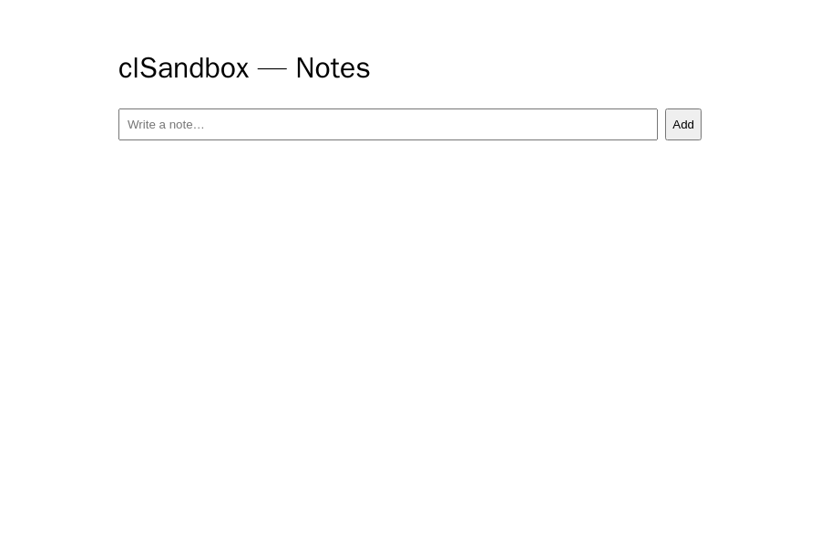
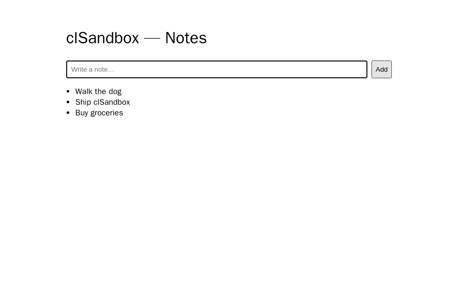

# clSandbox

A clean, modern, full-stack monorepo — **React + Go + Postgres**, containerized end to end, where every feature ships with a visual end-to-end test. Built to be secure, fast, scalable, and cheap to host.

> **Maintenance rule:** every code change must check this README. If behavior, features, routes, ports, or setup change, update the relevant section in the same commit. See [Keeping this README current](#keeping-this-readme-current).

---

## Run it (only Docker required)

Nothing needs to be installed on your machine except Docker.

```bash
docker compose -f compose.demo.yaml up --build -d
```

Then open **http://localhost:8080**.

This runs the full stack — Postgres + Go API + React web (behind nginx) — in **dev auth mode**, so no Clerk account is needed to click around. The API self-applies its database schema on boot.

Stop it:

```bash
docker compose -f compose.demo.yaml down        # keep data
docker compose -f compose.demo.yaml down -v     # wipe the database too
```

### Other ways to run

| Goal | Command | Notes |
|---|---|---|
| Manual navigation | `docker compose -f compose.demo.yaml up --build -d` | http://localhost:8080, no Clerk |
| Full E2E in containers | `make e2e-docker` | builds stack + runs visual tests, exits 0 on pass |
| Hot-reload dev (native) | `make dev` | needs Go + Node + pnpm; uses real Clerk |
| Production-shaped stack | `make up` | real Clerk; see `docs/DEPLOY.md` |

---

## Features (manual navigation guide)

Open **http://localhost:8080**. In dev mode you're automatically acting as the user `demo-user` (no sign-in screen).

> Screenshots below are generated automatically from the live app with `make docs-shots` — see [Keeping this README current](#keeping-this-readme-current).

### Notes — empty state

The landing page: a note input and an empty list.



### Notes — adding & listing

After adding notes, they appear newest-first.




| Feature | Where | How to use it | What happens under the hood |
|---|---|---|---|
| **View notes** | Main page, the list below the form | Notes you've added appear newest-first | `GET /api/notes` → Go API → Postgres, scoped to your user |
| **Add a note** | Text box + **Add** button | Type text, click **Add** (or press Enter) | `POST /api/notes` → validated (non-empty, ≤64KB) → inserted → list refreshes |
| **Empty / error states** | Below the form | Submitting nothing is rejected; if the API is down a red error appears | Client guards + API returns `422`/`500` with a JSON error |
| **(Prod only) Sign in / account** | Top-right | In a Clerk build, a sign-in button and account menu appear | Clerk session; the API verifies the JWT and scopes notes per real user |

### API endpoints (try them directly)

```bash
# health (no auth)
curl http://localhost:8080/healthz

# list your notes
curl http://localhost:8080/api/notes

# add a note
curl -X POST http://localhost:8080/api/notes \
  -H 'Content-Type: application/json' \
  -d '{"body":"hello"}'
```

In dev mode the API trusts a stub user (`demo-user`). Override it with a header to simulate another user and see per-user scoping:

```bash
curl http://localhost:8080/api/notes -H 'X-Dev-User: someone-else'   # returns []
```

---

## Architecture at a glance

```
Browser ──► web (React, nginx)
                │  /api/* proxied (single origin, no CORS)
                ▼
              api (Go, stdlib router)  ──►  Postgres (Neon in prod)
```

- **Frontend:** React 19 + TypeScript + Vite. Source in `apps/web/src`.
- **Backend:** Go, minimal dependencies, served from a `scratch` container. `apps/api/main.go`.
- **Database:** Postgres via `pgx`; queries are type-safe Go generated by `sqlc`; migrations via `goose` (`apps/api/db`).
- **Auth:** Clerk in production; an opt-in dev stub for local/CI. Default is always Clerk.
- **Hosting:** API → Cloud Run, web → Cloudflare Pages, DB → Neon. See `docs/DEPLOY.md`.

For working in the codebase (commands, conventions, the feature workflow), see **`CLAUDE.md`**.

---

## Keeping this README current

Treat docs as part of the change, not an afterthought. **On every code change, review this README** and update it in the *same commit* when any of these change:

- A user-facing feature is added, removed, or behaves differently → update **Features** **and regenerate screenshots**.
- A route, port, env var, or run command changes → update **Run it** / **API endpoints**.
- The architecture or a major dependency changes → update **Architecture at a glance**.

**Screenshots regenerate from the live app — never edit them by hand:**

```bash
make docs-shots     # rebuilds the app in a fresh container, recaptures every feature
```

Add a capture to `e2e/tests/screenshots.spec.ts` whenever you add a feature/page, then commit the updated PNGs in `docs/screenshots/`.

CI enforces both:

- a `docs` check flags PRs that modify `apps/**` without touching `README.md`/`CLAUDE.md`;
- a `screenshots` check regenerates the images and fails if the committed PNGs are stale.

If a change genuinely needs no doc update, include `[skip-docs]` in the PR title to bypass the `docs` check.
