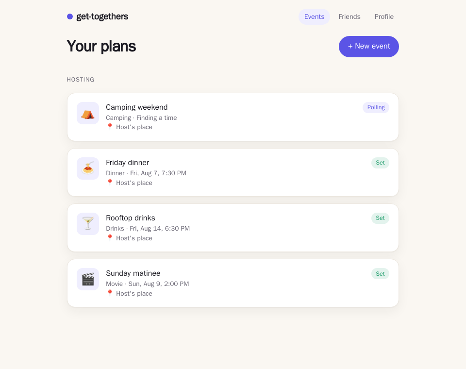
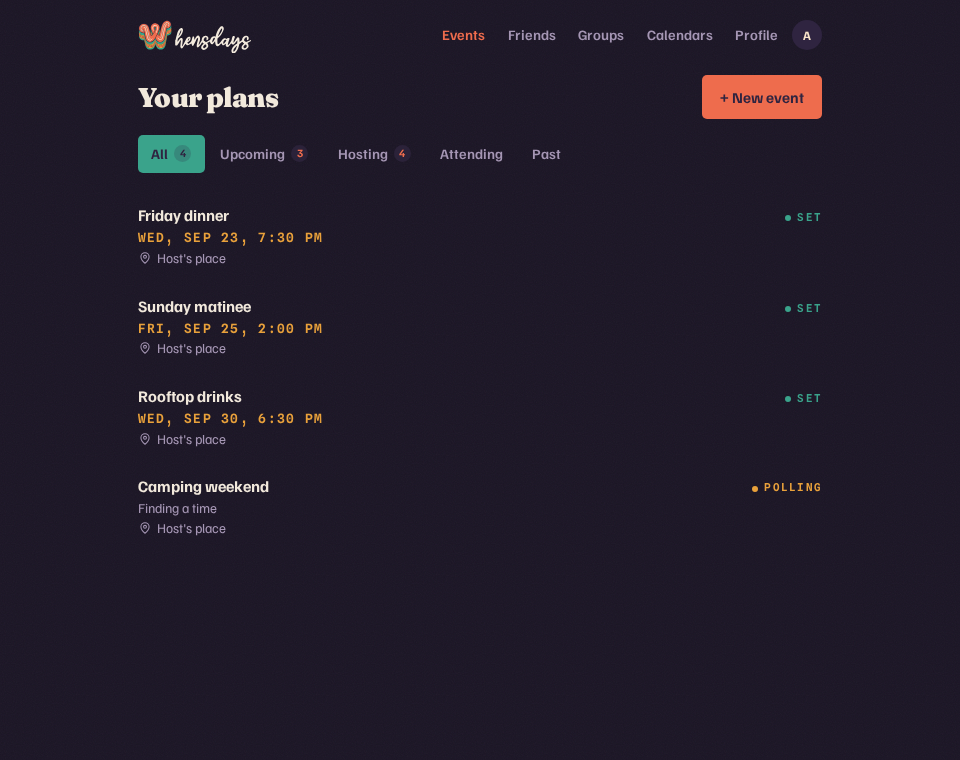
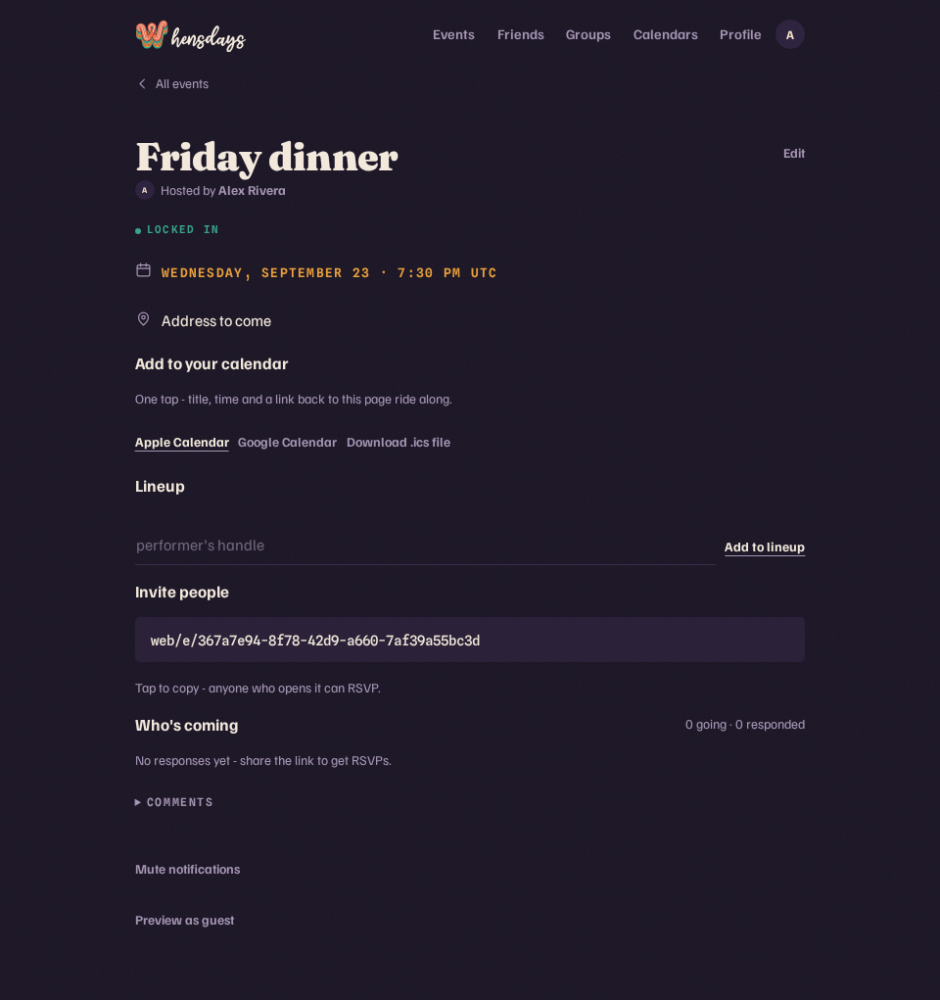
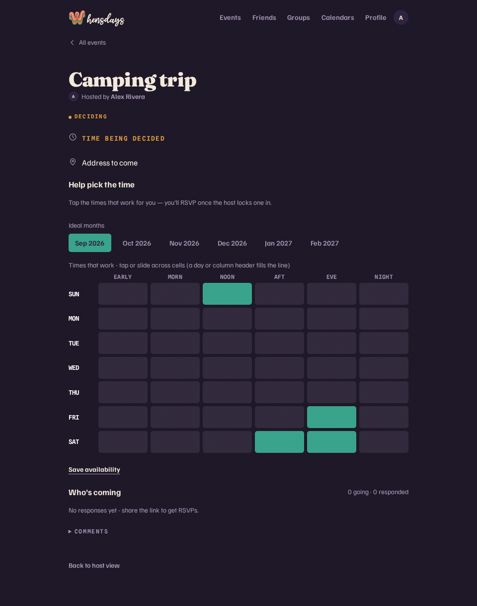

# Whensdays — free group scheduling app · [whensdays.com](https://whensdays.com)

**Whensdays is a free group-scheduling and availability app** for friend groups
and clubs, live at **https://whensdays.com**. Poll everyone on when they're free,
lock in the time that works for the whole group, and invite people with **one
link — no account needed to RSVP**. A free alternative to When2meet, Doodle,
LettuceMeet, and Timeful, built for groups that meet again and again: availability
polls, recurring series, group streaks, calendar sync (Google + Apple), and
one-tap RSVP straight from email.

**Plans, minus the group-chat chaos.** Host an event at your place or find a
venue, set a time or let everyone vote on availability, add friends, and see
when they're free.

Built on the **clSandbox** template — **React + Go + Postgres**, containerized
end to end, where every feature ships with a visual end-to-end test. Secure,
fast, scalable, and cheap to host. This app lives on the `app/scheduler` branch.

This `main` branch is the reusable template. **Every app built on it lives on its own branch** and is showcased below (full catalog in [`gallery/`](gallery/)).

---

## Apps

Each app is built on this template and lives on its own branch. To run one, check it out and start the demo stack (`docker compose -f compose.demo.yaml up --build -d`, then http://localhost:8080 — dev auth, no Clerk needed).

### get-togethers · `app/scheduler`

A minimal scheduling assistant — host or attend dinners, drinks, movies, trivia and parties; set a time or poll for availability; answer quick per-event-type preference questions; add friends and see when they're free.

[](gallery/scheduler/README.md)

```bash
git checkout app/scheduler   # details: gallery/scheduler/README.md
```

> _Adding an app: branch from `main`, build it, `make docs-shots`, then add a `gallery/<name>/` folder (screenshot + README) and a section here. See [`gallery/README.md`](gallery/README.md)._

---

> **Maintenance rule:** every code change must check this README. If behavior, features, routes, ports, or setup change, update the relevant section in the same commit. See [Keeping this README current](#keeping-this-readme-current).

## Product direction (read before adding features)

**Wedge:** recurring coordination for small friend groups & clubs (book clubs, run groups, D&D tables, monthly dinners, annual trips) — not one-off parties (Partiful) or work polls (Doodle).

Priorities, in order — growth loop over feature breadth:
1. **Frictionless guests** — invitees must be able to RSVP/vote/comment from the invite link *without creating an account* (capability link + name; convert later). The signup wall is the #1 conversion killer.
2. **Notifications** — transactional email (invite, votes, time locked, reminder, new comment). No nudges = no retention.
3. **Calendar as moat** — imported busy times should auto-block availability and rank candidate times, not just display.
4. **Recurring groups** — series events + a persistent group home (drives retention structurally).
5. **Monetize via intent, not walls** — affiliate/commerce hooks (reservations, lodging) and organizer premium later. Never paywall basics.

Measure in PostHog: activation (host invites ≥1), invite→participant conversion, participant→new-host (K-factor), events/group/month, W4 retention. **Feature breadth is not a moat — defer polish until the loop works.**

**Roadmap (updated 2026-07-08).** The foundational phases are **shipped** — including the real deploy (Cloud Run + Pages + Neon), live transactional email, guest→account merge, per-event mute, and host-timezone times. What remains is making one loop spin fast, then adding fuel.

**North-star metric: time-to-locked-plan** (event created → time finalized). Everything the group feels — relief, momentum, "this app works" — hangs on that moment. Guardrails: invite→RSVP conversion, participant→host conversion (K-factor), events per group per month, W4 retention.

**The loop (every feature must serve it):**
`host creates → invitees hit a zero-friction link → RSVPs pile up visibly → the time locks (the magic moment) → the event happens → the recap pulls everyone back → "same time next month?" re-hosts` — each turn of the loop mints new hosts from guests.

- **Now — tighten the loop:**
  - **One-tap RSVP from email** — "Going / Can't make it" buttons in the invite + reminder emails via signed links (same HMAC pattern as one-click unsubscribe). Every removed tap on the guest path compounds.
  - **Live social pressure on the invite page** — "4 of 7 in" progress + the facepile above the fold; a host **Nudge** button that re-emails only non-responders (rate-limited, once per day).
  - **Lock-the-time celebration** — shipped: finalizing shows a one-shot "Locked in — {date}" banner (stripe rule, no confetti) and the per-event OG card already carries "N in so far" social proof; one-tap add-to-calendar for everyone is the piece still open.
  - **Seed real groups** (improv/stand-up/theater locals — the show/practice/open-mic types exist for this) and watch the funnel in PostHog before adding surface area.
- **Next — retention fuel:**
  - **Post-event recap thread** — a day-after email: "How was it? Add a photo from the night" → the comment thread becomes the group's memory, and the recap ends with **"Plan the next one"** (pre-filled from the last event). Post-event is where the next event is born.
  - **Group rituals & streaks** — "3rd Thursday · 4 months running" on the group page; breaking the streak should feel like a loss (structural retention for the wedge audience).
  - **Best-time ranking across everyone** — rank poll options against ALL attendees' availability + imported calendars, not just the viewer's. The "it just knows" moment.
  - Series editing (change one vs all occurrences).
- **Later:** organizer premium (never paywall basics), per-user live `.ics` feeds, localization, re-expanding Discover once group density exists.

### Viral-readiness: add / update / remove

| Action | What | Why |
|---|---|---|
| **Add** | One-tap RSVP links in email | Highest-leverage conversion fix left — guests say yes without ever loading the app |
| **Add** | Nudge non-responders (host, one tap) | Hosts are the engine; this answers the #1 host anxiety ("nobody replied") |
| **Add** ✅ | Finalize celebration + QR invites | Shipped: lock-moment banner, and the invite card opens a **theme-matched QR code** in one tap for the in-person moment - hold your phone up, everyone scans, they land on RSVP. The invite unfurl carries **"N in so far"** (og.png + description) so the group chat sees momentum. (A decorative share-card PNG shipped first and was replaced - a static image was a dead end) |
| **Add** | Post-event recap → "plan the next one" | Converts a finished event into the next one — the re-host loop is the real K-factor |
| **Add** | Group streaks | Loss-aversion retention, purpose-built for recurring groups |
| **Update** | Invite page as the flagship screen | The most-seen surface by new users: social proof above the fold, RSVP within thumb reach, zero chrome |
| **Update** | Poll ranking → all-attendee availability | Upgrades calendars from display-only to decision-making moat |
| **Remove (de-emphasize)** | Discover / For-you feed / follows / topic-city taxonomy | A public social graph before density = empty rooms + moderation surface. Keep the code; pull it from the nav until groups are dense |
| **Remove** ✅ | Event types + per-type preference questions | Done: event types are gone entirely (no picker, no "other", no type-colored tiles) and the per-type preference questions went with them — an extra step on the critical path whose answers were rarely load-bearing. Anything a guest needs to tell the host goes in comments |
| **Remove (simplify)** | Dual availability systems (weekly grid + date grid) | Two grids confuse; date-based wins, weekly becomes a prefill |

Shipped, mapped to the original phases:
1. ✅ **Frictionless guests** — no-account RSVP/vote/comment via the invite link; guests can host ("Start a plan"); guest→account merge on sign-up.
2. ✅ **Notifications** — branded transactional email (invite, finalize, comments, day-before reminder, cancel) rendered in the host's timezone, per-event mute with one-click unsubscribe, in-app badges.
3. ✅ **Calendar** — import (Google OAuth / Apple iCal) blocks availability + flags poll conflicts; one-tap export (Apple/Google/.ics with a link back).
4. ✅ **Recurring groups** — groups with icons/members, recurring series events, group event lists.
5. ✅ **Growth surfaces** — OG unfurls with a branded per-event card, Web Share, PWA, quick-create, code-split bundle, public Discover + ranked For-you feed with follows, event covers (photo/Klipy GIF) + backdrop themes (flowing gradient washes), avatar-stack social proof on tiles.


---

## The template

Everything below documents the clSandbox scaffold itself — how to run it, its reference feature (Notes), architecture, and conventions. Apps inherit all of it.

## Run it (only Docker required)

Nothing needs to be installed on your machine except Docker.

```bash
docker compose -f compose.demo.yaml up --build -d
```

Then open **http://localhost:8080**.

This runs the full stack — Postgres + Go API + React web (behind nginx) — in **dev auth mode**, so no Clerk account is needed to click around. The API self-applies its database schema on boot.

Stop it:

```bash
docker compose -f compose.demo.yaml down        # keep data
docker compose -f compose.demo.yaml down -v     # wipe the database too
```

### Other ways to run

| Goal | Command | Notes |
|---|---|---|
| Manual navigation | `docker compose -f compose.demo.yaml up --build -d` | http://localhost:8080, no Clerk |
| Full E2E in containers | `make e2e-docker` | builds stack + runs visual tests, exits 0 on pass |
| Hot-reload dev (native) | `make dev` | needs Go + Node + pnpm; uses real Clerk |
| Production-shaped stack | `make up` | real Clerk; see `docs/DEPLOY.md` |

The end-to-end tests and their latest results are documented in **[E2E.md](E2E.md)**.

**Testing with two users (dev mode):** open the app with `?as=<name>` to act as that
user (the API trusts an `X-Dev-User` header in dev). The id is stored per browser
tab, so two tabs can be two people at once — e.g. visit `http://localhost:8080/?as=alice`
in one tab and `?as=bob` in another to test friend requests, invites, and RSVPs.

---

## Features (manual navigation guide)

Open **http://localhost:8080**. In dev mode you're automatically acting as the user `demo-user` (no sign-in screen).

> Screenshots below are generated automatically from the live app with `make docs-shots` — see [Keeping this README current](#keeping-this-readme-current).

### Your plans — the dashboard

The home page lists what you're hosting and what you've been invited to, with a
**+ New event** button. First visit asks only for a name and a handle.



### An event — host view

Each event has a shareable invite link, an availability poll (when the time
isn't fixed), and the guest list. Tap **Preview as guest** to see exactly
what invitees see.



### General availability — pick times per day

A general poll is scoped by the host: **this week** (guests tap a grid of the next
7 concrete dates × times of day), **this month** (guests tap the days that work over
the next 4 weeks), **generally** (ideal months + a weekday × time-of-day grid,
fill a row/column from its header), or **pick days** (the host hand-picks specific
calendar days from a forward calendar + a time window; guests then paint the
**actual clock times** that work on each — a When2meet-style grid). The host sees a
matching heatmap or day ranking. **Guests on an open poll are asked for their
availability first, not to RSVP:** while no time is locked there is nothing to say
yes to, so a guest who just typed their name lands straight on the vote grid
(prominent, expanded) and the RSVP card is hidden until the host schedules a time.
The authed RSVP-first flow is unchanged.



| Feature | Where | How to use it | Under the hood |
|---|---|---|---|
| **Profile** | First run / **Profile** | Set a display name + unique handle, a **profile photo** (a crop dialog lets you pick which circle of the photo shows; event covers get the same with a square), and your **availability** — either a **recurring weekly** pattern (weekday × morning/afternoon/evening) or **specific dates** (paginated two weeks at a time, up to ~12 weeks ahead). The grid is **tri-state** — **green = free, red = busy, blank = not set** (a legend explains it) — with a **Free / Busy** brush toggle so a tap **or a finger-slide across cells** (or a row/column header fill) paints either state; answering an event's availability poll also fills these cells in automatically; imported-calendar conflicts are locked (hatched) | `PUT /api/profile`, `PUT /api/profile/avatar`, `PUT /api/availability` (weekly), `PUT /api/availability/days` (dates) — each cell carries a `status`, scoped to your user |
| **See friends' availability** | **Friends** | Open an accepted friend to see their real upcoming free dates/times (+ what they're booked for) | `GET /api/friends/{id}/availability` |
| **Who's coming + add friends** | Event page | A clear **RSVP-grouped guest list** (Going / Maybe / Can't go); any real (non-guest) attendee who isn't already your friend gets a **+ Add friend** button right there | `GET /api/events/{id}` (attendees carry `handle`), `POST /api/friends` |
| **Address autocomplete + directions** | New/Edit event | The location field has **free type-ahead** (OpenStreetMap via Photon — no key, no billing); on the event page the address shows **both a Google Maps and an Apple Maps link** (no universal "default map app" URL exists across platforms, so both are offered) | `GET /api/geo/search` (server-proxied); `google.com/maps` + `maps.apple.com` links |
| **Create an event** | **+ New event** | **One create flow, the only way to make an event** (the old multi-step wizard was removed — there is no location screen, capacity field or specific-times-poll mode at creation, and **events have no type at all**). Name it, then either **I'll set the time** (a datetime) or **Ask when people are free** (an availability poll with the **scope chosen right here** — this week / this month / generally / pick days). That's it — you land on the event page ready to share. Cover/theme, description, location, capacity and end time are all set afterward via **edit-in-place** on the event; friend-invites via the invite card. Reached three ways (all the same flow): the Home/group **+ New event** buttons (`/new`), the free-scheduler "Start a plan" guest entry (`/start`), and the legacy `/quick` alias | `POST /api/events` (`scheduling_mode: fixed \| general` with `general_scope`) |
| **Your plans** | Home | A filter row (**All / Upcoming / Hosting / Attending**, with counts) narrows the event list; **NEW** badges on events you haven't opened; each tile shows a **who's-going avatar stack** (friends first — accent ring — then people with photos, then initials) with a **+N more** tail | `GET /api/events` (returns `unseen` ids + per-event `faces`) |
| **Dark / light theme** | Profile → Appearance | Dark by default; toggle to light (persisted, no-flash). Both themes are **glass panels over a slowly drifting CSS sky** — dusk (dark) or open day sky (light); no image assets, respects reduced-motion | client-only, `data-theme` on `<html>`, design tokens in `styles.css` |
| **Guest keeps their plans** | Sign up after using it as a guest | Everything a guest did — hosted events, RSVPs, comments — follows them into the new account; their name is prefilled | `POST /api/guest/merge` (transactional reassign) |
| **Account settings** | Profile (signed in) | Our own card: primary email, change email (verification code), sign out — not Clerk's widget | `ClerkAccount.tsx` via Clerk hooks |
| **See who picked what** | General-availability event (host) | A row of responder avatars; tap one to highlight exactly the times/days that person chose | `GeneralResults` overlays each user's `general_votes` |
| **Rich link previews** | Any shared invite | Texting an invite link unfurls a **per-event card**: the event's cover photo/GIF as the big tile, the **host's name top-left** ("… invites you") and the **logo top-right**; cover-less events get a branded gradient card with the title. Composited server-side in Go (`/api/events/{id}/og.png`) | `handleOGPage` (`ogpage.go`) + `apps/web/public/og-card.png` |
| **RSVP** | Event page | Going / Maybe / Can't — with an optional **"Hide my name" checkbox**: an anonymous RSVP counts in every total (who's-in, capacity, unfurl) but shows as "Anonymous" to everyone else, host included (masked server-side; the host email says "Someone") | `POST /api/events/{id}/rsvp` (`anonymous` flag, `0041`) |
| **Scheduling — fixed time** | New event → "I'll set the time" | Host sets the date/time up front. Turning it into a **recurring series** (repeat pattern or extra dates) happens afterward via **edit-in-place** ("+ Add another date" grows a lone event into a series) — creation itself takes just the one time | `scheduling_mode: "fixed"` |
| **Scheduling — specific-times poll** | Event page (existing poll events) | Guests vote Yes / – / No on each proposed time; host **Picks** one to lock it in. **This mode is no longer creatable from the UI** (the create flow removed it), but the mode still exists server-side — existing poll events still vote/finalize, and the API accepts `scheduling_mode: "poll"` + `time_options` | `POST /api/events` (`scheduling_mode: "poll"`), `POST /api/events/{id}/votes`, `POST /api/events/{id}/finalize` |
| **Scheduling — general availability poll** | New event → "Ask when people are free" | The **scope is chosen right in the create flow** — **this week** (concrete dates × times grid), **this month** (tap the days that work), **generally** (ideal months + weekday grid), or **pick days** (host hand-picks specific calendar days + a time window; guests paint the **actual clock times**, When2meet-style). Attendees then answer in that shape and the host reads a matching heatmap/ranking, then finalizes a time. Date windows anchor at the event's creation so everyone answers about the same days | `POST /api/events` (`scheduling_mode: "general"` with `general_scope`, and `poll_days`/`grid_start`/`grid_end` for the pick-days scope), `POST /api/events/{id}/general-votes`, `POST /api/events/{id}/finalize` |
| **Host view + guest preview** | Event page (host only) | Invite link, poll results, guests; toggle to preview the guest flow | role-aware `GET /api/events/{id}` |
| **Comments** | Event page | A chat-style thread on each event (avatar bubbles, your own tinted, relative timestamps); anyone with the invite can post — **text, a GIF (Klipy picker), or both**. Authors delete their own; the host (or a cohost) moderates any — deletes are two-tap confirmed like every destructive action. The host can turn the thread on/off | `POST/DELETE /api/events/{id}/comments`, `PUT /api/events/{id}/comments-enabled` |
| **Cohosts** | Event page (host only) | The host delegates by handle: a **cohost** can edit the event, share the invite (sees the host view), and moderate comments — but can't manage cohosts or toggle the thread | `POST /api/events/{id}/cohosts`, `DELETE /api/events/{id}/cohosts/{userId}`, `PUT /api/events/{id}` (edit, host+cohost) |
| **People you may know** | **Friends** | Suggestions ranked by shared-event overlap — co-attending a public event is the weakest signal, both being *going* to a friends-only/invite-only event is the strongest. One-tap Add | `ListPeopleYouMayKnow` in `discover.sql`, surfaced in `GET /api/friends` |
| **Friends** | **Friends** | Add by handle (request + accept), then view an accepted friend's weekly availability | `POST /api/friends`, `POST /api/friends/{id}/accept`, `GET /api/friends/{id}/availability` |
| **Cancel / delete / remove** | Event page, group page, Friends | Hosts **cancel** events (or a whole series) — guests see "Cancelled", attendees get an email; group owners **delete** groups (events survive); friends: **decline** incoming, **cancel** outgoing, **remove** accepted | `DELETE /api/events/{id}[?series=all]`, `DELETE /api/groups/{id}`, `DELETE /api/friends/{id}` |
| **Edit an event — in place** | Event page hero (host/cohost) | Edit flips the top card into inline editing: title, details, **address (or an online meeting link)**, **capacity**, visibility (creation doesn't ask - events start invite-only and open up here), an **optional end time**, **more dates ("+ Add another date" grows a lone event into a series - everyone on it is carried over, RSVPs intact)**, **the start time (editable even after it's finalized — rescheduling re-sends the day-before reminder)** — plus a labelled **Cover image** block ("a photo or GIF at the top of the invite") offering **Add photo** and **Add GIF** side by side — the Klipy grid only appears once you tap **Add GIF**, so opening Edit no longer dumps a wall of trending GIFs on you — shown as the **tile's main visual on every list** (dashboard, Discover, groups); **an event with no cover shows no image at all — the title leads, on the page and in every list** — and a **backdrop theme** (party/beach/forest/night/neon/cozy) that tints the whole event page. Since creation asks only for title + time, **this is where type-less events get their location, capacity, cover and look** | `PUT /api/events/{id}` (manager-gated); `GET /api/gifs/search` (server-side `KLIPY_API_KEY`, never sent to the browser) |
| **Export to your calendar** | Event page (confirmed events) | One tap: ** Apple Calendar** (plain link — iPhone/Mac open it natively), **Google Calendar**, or a **.ics download**; title, time and an **RSVP link back to the event** ride along | `GET /api/events/{id}/calendar.ics` — served `inline`, **unauthenticated by design** (the event id is the invite capability, same fields as the OG unfurl) |
| **Start a plan (no account)** | Free scheduler (`/free-scheduler`) | An any1.free-style one-pager that completes the WHOLE thing itself, no SPA hand-off: name the plan, your name, pick dates (calendar grid + "Next 7 days"/"This weekend"/"Next 2 weekends" shortcuts), get a shareable link right there. A live "N events scheduled so far" counter sits below (hidden until a real count loads). "Manage this plan" carries the guest session into the real event page, already recognized as host. `/start` (`/new`'s guest alias) still works, just isn't linked from the UI anymore | `POST /api/guest/join` without an `event_id`, then `POST /api/events` (`Authorization: Guest <token>`, `scheduling_mode: general`, `general_scope: dates`); `GET /api/public/stats` (unauthenticated, count of locked-in events) |
| **Link unfurls** | Automatic | Invite links pasted into iMessage/WhatsApp/Discord show the event title + time ("Tap to RSVP, no account needed"); browsers bounce into the app at `/ev/{id}` | nginx proxies `/e/{id}` full-page loads to the API's OG shell (`ogpage.go`) |
| **Join as a guest (no account)** | Any invite link, signed out | Invitees enter just a name to RSVP, vote, and comment; a signed guest token (90d) lives in their browser. Dev/E2E: append `?guest=1` | `POST /api/guest/join` (unauthenticated; event id = capability), `Authorization: Guest <token>` |
| **WGIS venue sync** | Daily (cron) | The group's WGIS (World's Greatest Improv School) improv jams track the venue's real schedule from its **JSON feed** (crowdwork.com) — no scraper or browser needed, so the server fetches it directly: `POST /api/cron/wgis-sync` (X-Cron-Key, body `{group_id}`) filters the feed to jams and, since it's a curated single-venue list, **auto-creates** any jam the group doesn't have yet (title, description, dates, and the poster pulled in as the cover), then keeps every series current (add/retime/quiet-cancel) hosted by a hidden **WGIS Schedule bot** with the group owner kept on as cohost. Shares the reconciliation engine with the UCB sync | `apps/api/wgissync.go` + `venuesync.go`; secrets `CRON_KEY`, group id |
| **We Improv venue sync** | Daily (cron) | The group's We Improv (weimprov.org, an LA improv theatre) jams track the venue's real schedule from its **Squarespace JSON feed** (any page + `?format=json`) — no scraper or browser, the server fetches it directly: `POST /api/cron/weimprov-sync` (X-Cron-Key, body `{group_id}`) filters to jams (case-insensitive "jam" in the title — **currently matches nothing** since the venue posts no jams yet, but the pattern is in place so a new jam flows through automatically) and, being a curated single-venue list, **auto-creates** any jam the group lacks (title, cleaned description, dates, poster pulled in as the cover), then keeps every series current (add/retime/quiet-cancel) hosted by a hidden **We Improv Schedule bot** with the group owner kept on as cohost. The feed is FLAT (one item per occurrence, `startDate` epoch millis) vs. WGIS's grouped dates, but shares the same reconciliation engine | `apps/api/weimprovsync.go` + `venuesync.go`; secrets `CRON_KEY`, group id |
| **UCB venue sync** | Monthly (cron) | The group's recurring UCB jams track the venue's REAL schedule: a monthly scraper (headed Chromium via Playwright — UCB sits behind a Cloudflare JS challenge, so it runs in `.github/workflows/ucb-sync.yml` or locally via `make ucb-sync`) parses ucbcomedy.com and POSTs the listings to `POST /api/cron/ucb-sync` (X-Cron-Key). The server matches titles already in the group (fuzzy "series key" — subtitle/guest decorations ignored), re-hosts them to a hidden **UCB Schedule bot** (previous host stays cohost), adds missing dates as series siblings (content + cover carried), retimes moved shows, and quietly cancels dates the venue pulled (only inside the scraped window). Unknown titles are ignored, so seeding one occurrence of a show is all it takes to start tracking it | `apps/api/ucbsync.go` + `e2e/scripts/ucb-sync.mjs`; secrets `CRON_KEY`, `UCB_GROUP_ID` |
| **Rozco's venue sync** | Monthly (cron) | The group's **Eastside Open Mic** (Rozco's Comedy Club, an East Austin club) tracks the venue's REAL schedule from its ticketing platform. Rozco's sells each open-mic occurrence as its own SimpleTix event, and SimpleTix server-renders a clean **JSON-LD `Event`** (with `startDate`) on every event page — so a plain server-side GET returns the real dates, **no headed browser needed**: `POST /api/cron/rozcos-sync` (X-Cron-Key, body `{group_id}`) fetches the org listing, filters to `eastside open mic` (the listing is Rozco's whole catalog — hundreds of *produced* shows too, so the title is the filter), reads each occurrence's authoritative `startDate` from its JSON-LD, and keeps the series current (add/retime/quiet-cancel) hosted by a hidden **Rozco's Schedule bot** with the seeder kept on as cohost. Because it's an **HTML/JSON-LD scrape** (not a clean first-party API), **autoCreate is OFF** like UCB — seed one "Eastside Open Mic" occurrence to start tracking it. `ROZCOS_MODE=stub` for hermetic E2E | `apps/api/rozcossync.go` + `venuesync.go`; secrets `CRON_KEY`, group id |
| **Email notifications** | Automatic | Uses your **account email** (from Clerk — no separate field to fill): hosts hear about RSVPs & comments in a **once-daily digest** (2pm Pacific — one email however many people comment or flip RSVPs; RSVPs are visible in-app immediately either way). Anything time-sensitive is **sent the moment it happens**: the **invite**, the **time-locked** note, the **everyone-has-voted** nudge, a **cancel** notice, and the **day-before reminder** (2pm Pacific for next-day events). Branded HTML (logo, the **event's theme colors**, and its **cover GIF** when set); a person with **several events tomorrow gets one digest email** listing them all; **times render in the event's timezone** (the host's, captured at creation), not UTC; every link is UTM-tagged so PostHog attributes email-driven visits. No-op unless `EMAIL_API_KEY`/`EMAIL_FROM` set | `internal/notify` (Resend-compatible) + `emails.go` templates + `notifications.go` triggers, async; `POST /api/cron/reminders` (X-Cron-Key) |
| **RSVP auto-blocks availability** | Profile + Friends | Events you're going to overlay your availability grid as booked (hatched) — and your friends see them on yours. Derived live from RSVPs, so changing plans never leaves stale data | commitments ride in `/api/availability/days` + the friend availability endpoint |
| **Multi-date finalize** | Any poll results (host) | **Tap winning cells right on the heatmap** (or Select several poll options) to schedule one or many dates at once — they become one series with everyone (RSVPs intact) on each date. Month polls are a full day × time grid now | `more_starts` on finalize; attendees + invites copied per occurrence |
| **Best-time ranking** | Poll results (host) | Candidate times are ranked by votes AND how they fit **everyone's** saved availability (a "N free / N busy" count per option, best gets a **Best** pill) — not just the viewer's calendar | `option_fit` computed server-side from all attendees' availability |
| **Series editing (one vs all)** | Event edit (series) | An "apply to all dates" checkbox copies title/details/cover/theme to every occurrence; each date keeps its own time | `apply_series` on `PUT /api/events/{id}` |
| **Drafts** | Event page (host) | Park an event: content kept, hidden from guests, all emails paused - publish restores it exactly. Drafts live under their own Home filter | `POST /api/events/{id}/draft`, status `draft` |
| **Capacity & waitlist** | Create/edit an event | Cap the guest list; extra RSVPs join a waitlist and are auto-promoted (with an email) when a spot frees. The invite shows spots left | `events.capacity`, rsvp `waitlist`, promote-on-free |
| **Poll deadlines** | Create/edit a poll | Optional "poll closes" date: non-voters get a last-chance email the day before, votes stop at the deadline, and the host gets a "ready to lock" email listing the winning times; if everyone invited votes early, the host hears immediately | `poll_deadline` + cron; quorum check on every vote |
| **Private calendar import** | Profile → Connected calendars | Google (OAuth), **Apple (CalDAV + app-specific password - nothing published)**, or a published link (works for Outlook too) as fallback; all read-only, credentials encrypted at rest | `POST /api/calendar/apple-caldav` |
| **Live calendar feed** | Profile → Connected calendars | Subscribe once (webcal for Apple/Outlook, URL for Google) and every event you're going to appears in your calendar automatically | `GET /api/feed.ics?token=` (signed personal URL) |
| **Photos in comments** | Event page | Attach a photo (client-downscaled) or a GIF to any comment - the thread becomes the group's memory | comment `gif_url` accepts uploaded images |
| **Chat-ready invites** | Invite card | WhatsApp and text-message buttons with the invite pre-written | prefilled deep links |
| **Group links: public page vs invite** | Group page → **Share your page** / **Invite to join** cards | **Two links off one group, and the difference is the point — TWO SEPARATE cards, not two sections of one.** **Share your page** = the bare `/g/{id}` + QR: anyone (no account, no guest name entry) sees the group's name, icon, description, **follower/member counts**, **upcoming listed events**, a collapsed **Past** section (bounded, listed-only, most recent first — social proof for a venue), and can **Follow** — but there is *no way to join*. **Invite to join** = `/g/{id}?invite=<token>`: the same page plus a **Join this group** button, and joining is what unlocks the member list and *all* the group's events. Any member can send the invite link (or its **QR**, for the in-person "scan to join"); owners/admins can **Regenerate** it (two-tap), which kills that group's outstanding invite links and nothing else. `?from=<uid>` is share *attribution* only (it names the inviter in the unfurl) and authorizes nothing. **Pasting either link into a chat unfurls a rich preview** — the group's GIF/icon, the group name, and copy matching the link kind. The member view of the group page also shows its **follower count** so an owner watches their audience grow | `GET /api/public/groups/{id}` (**unauthenticated**, entity-shaped, adds `follower_count` + a bounded `past_events`), `GET /api/groups/{id}` (adds `follower_count`), `POST /api/groups/{id}/join` `{invite}` (403 without a live token), `POST /api/groups/{id}/invite/rotate` (owner/admin); `groups.invite_token_version` (migration `0045`); unfurl via `handleGroupOGPage` + `GET /api/groups/{id}/og.png` (bounces browsers to `/gv/{id}`) |
| **Group streaks** | Group page + email | An amber "N-MONTH STREAK" stamp — consecutive months with at least one event; and when the streak extends into a new month **every member gets one congratulation email** (once per group per month) | web: computed from the group's events; email: daily cron, `group_streak_congrats` gate |
| **Irregular recurring series** | New event (fixed time) | "+ Add another date" stacks several explicit dates (any days — no fixed pattern) into one series; everyone RSVPs per date | `more_starts` on `POST /api/events`; shares the existing `series_id` machinery |
| **Series re-poll** | Series card + automatic email | When a series' last date is near (or has passed), the host gets one tap to open a prefilled **poll for the next dates** that **re-invites everyone** from the old event; also arrives automatically by email after the final occurrence | `/new?again=<id>&repoll=1` → `invite_from` on create; `notifySeriesEnded` rides the daily cron |
| **Post-event recap → plan the next one** | Day-after email | "How was it? Add a photo from the night" pulls everyone back to the thread (the group's memory); **Plan the next one** opens the create flow prefilled from the event (title + a full clone of its look/content — description, location, cover, theme) — the re-host loop | rides the daily cron; `event_recaps` (idempotent); `/new?again=<id>` prefill |
| **Mute an event** | Event page + any email | A "Mute notifications" toggle on any event (host or attendee) stops its notification emails. Also one-click from the footer of every email — no login needed (identity rides in a signed token) — with an instant undo | `POST /api/events/{id}/mute` (signed-in) + `GET /api/events/{id}/unsubscribe?token=` (HMAC, unauthenticated); `event_mutes` table |
| **One-tap RSVP from email** | Invite / nudge / reminder emails | "I'm going" / "Can't make it" buttons answer straight from the inbox — no login, no app load (signed per-recipient links; confirmation page with one-tap undo). The reminder carries a "can't make it anymore?" escape hatch | `GET /api/events/{id}/rsvp-link?token=&r=` (HMAC, unauthenticated, rate-limited) |
| **Nudge non-responders** | Event page (host/cohost) | One tap re-emails only the invited people who haven't answered, with one-tap RSVP buttons. Rate-limited to once a day per event | `POST /api/events/{id}/nudge`; `event_nudges` table |
| **The lock moment** | Event page | When the time gets finalized, the page celebrates: a stripe-crowned "Locked in — {date}" banner (one-shot, deterministic, no confetti) | client-side, fires on the polling→scheduled transition |
| **Who's in** | Invite page (guests) | "4 of 7 in" progress bar + the going facepile above the fold — social proof where new invitees land | computed from attendees + pending invites in the event detail |
| **Discover (public events)** | **Discover** — works signed-out | Events are **invite-only, friends, or public**. Public ones take a **preset category** (13 incl. Comedy & performance, server-enforced — never free text) + a city (curated autocomplete list, prefilled from your timezone; no external geo API). Browse/filter by category chips (**dynamic — a chip only renders when that category has an upcoming event**) & city; **follow hosts or categories** | `GET /api/discover` (unauthenticated, read-only), `POST/DELETE /api/follows` |
| **Tile styling** | Everywhere events are listed | Tiles carry a **type-colored edge** (dinner amber, drinks violet, …); in the stream, events **you're going to glow accent**, **friend-connected ones glow green**, plain public stays neutral; a **"N friends going"** badge shows social proof | annotated `friends_going`/`viewer_rsvp`/`from_friend`; `GET /api/discover/mine` (authed twin of the public browse) |
| **"For you" feed** | **Discover**, signed in | Ranked like a (transparent) social feed: follows > friends-going social proof > your RSVP-history taste (host/category/type) > popularity > time-proximity sweet spot. The default scope is **public browse ∪ everything you follow** (deduped); `scope=friends` shows what your friends are hosting, `scope=following` only what you follow | `GET /api/feed?scope=public\|friends\|following`; scorer + weights in `apps/api/ranking.go` |
| **Following** | Group page, event page ("Hosted by" row) & **Home** | **Follow a host or a group** — an artist, venue or club — and their **listed** events land in your feed. Asymmetric and **not Groups**: you can follow a club without joining it (Follow lives on the group's public page, which a non-member reaches from the bare link), and members can follow too. Hosts control what surfaces per event with a **"Show to my followers"** checkbox (create wizard + edit form, on by default; every pre-existing event was backfilled OFF). *Deliberately not called "subscriptions" — that word means .ics calendar sync here.* Because the backfill turned every pre-existing event OFF, an established group's public page can look empty — so owners/admins see **"N upcoming events aren't shown on your public page"** with a one-tap fix. **Followed events also ride the main Home feed** (not a buried tab): a **"From pages you follow"** section under your own tiles shows the next 3 (deduped against your own hosting/attending list), each with a **"via {page}"** (or, for a followed performer — see below — **"with {performer}"**) attribution line linking to the group; a **Following filter chip** (renders only once you follow something, like Drafts) shows the full followed list, reached either by tapping the chip or the section's "See all". Followers also get a **once-daily digest email** of new listed events from the pages they follow (created in the last 24h; skips events they created or already RSVP'd to) — one email per recipient with cover thumb, one-tap RSVP, and a per-page "unfollow" link, riding the existing daily reminders cron with no schedule of its own. **Following a person also surfaces every event they PERFORM on**, not just ones they host — see **Performers on events** below | `POST /api/follows` `{kind: host\|topic\|group}`, `DELETE /api/follows/{kind}/{value}`, `GET /api/feed?scope=following`; `events.listed` (migration `0044`); `PUT /api/events/{id}/listed` (manager-gated one-field toggle); dashboard `GET /api/events` returns a cheap `follow_count` gating the Home fetch, and its `ListPublicEvents`/`ListFollowedEvents`/`ListFriendsEvents` rows carry `group_id`/`group_name`/`performer_name` for tile attribution; digest: `followdigest.go`, `GET /api/follows/unsubscribe?token=` (HMAC, unauthenticated) |
| **Performers on events** | Event page — **Lineup** card | Any event can carry a **lineup of real performers**, added by handle (like cohosts) — no free-text "special guests" beyond the description. Visible to everyone including guests: avatar, name, a **Follow button per performer** (following a person already means "see their events" — no new follow kind), and a **Pending** pill (visible only to managers and the performer, since it's the host's own claim, not yet public). A newly-added performer starts **pending** and gets an email with one-tap **Confirm / Remove** links; only once they **confirm** does the event reach *their* followers' feed and digest — display on the event page itself is immediate, but distribution is consent-gated (anti-hijack: a host can't blast a well-known performer's audience just by tagging them). A pending performer also sees an in-app banner on the event page with the same Confirm/Remove choice. Performers can remove themselves anytime; managers (host/cohost) add and remove like cohosts. A performer-attributed feed/digest row reads **"with {performer}"** (attribution order: group page > performer > host) | `POST /api/events/{id}/performers` (manager, by handle), `DELETE /api/events/{id}/performers/{userId}` (manager or self), `POST /api/events/{id}/performers/confirm` (self), `GET /api/events/{id}/performers/link?token=&action=confirm\|remove` (unauthenticated, HMAC `perf\|` token); `event_performers` (migration `0046`); lineup rides the event detail (`performers`, each with `following`); `ListFollowedEvents`/`ListNewFollowedEvents` gain a third, confirmed-only match arm (`performers.go`, `followdigest.go`) |
| **Groups** | **Groups** | Persistent circles (book club, run crew): create, add members by handle, attach events; the group page shows a **compact member summary** (a few faces + a count) that opens a **dedicated members page** (`/g/{id}/members`) with the full list + admin controls (so a big group never walls the page behind hundreds of cards), plus all its events. Icon = an **emoji from the palette or an uploaded photo** (never free text). Membership is **symmetric** — see **Following** for the asymmetric "just show me their plans" relationship; the two are separate and neither replaces the other. The create form asks **what it's for** — "Friend group" or "Venue or performer page" — the SAME entity either way (no new field): the page choice only tunes the description placeholder, and where you land after creating | `POST/GET /api/groups`, `GET /api/groups/{id}`, members add/remove, `PUT /api/groups/{id}/icon`; `POST /api/events` takes `group_id` |
| **Create your page (onboarding)** | Landing → **Create your page** | The landing's primary CTA carries the page-creation intent through sign-up (`?redirect_url=/groups?purpose=page`, the same mechanism the guest-login "Log in" link uses) so a brand-new signed-up user lands straight in the purpose-tuned create form instead of a generic Home — a sessionStorage flag is the fallback carrier for the same round trip. Choosing **"Venue or performer page"** pre-fills the description placeholder and, on create, routes straight to the new group page with a one-time **"Your page is live"** callout above the (already-first) Share-your-page card. A brand-new owner (exactly one group, zero events yet) also gets a quiet **"Post your first event"** nudge in Home's empty state | `App.tsx` `PAGE_INTENT_KEY`/`AuthPage`; `Groups()`'s purpose toggle + `?created=page`; `Home.tsx`'s owned-group empty-state check |
| **Recurring events** | New event → fixed time → "Repeats" | Weekly / every-2-weeks / monthly, 2–12 occurrences, materialized up front as separate events sharing a series (per-occurrence RSVPs); the event page shows "Repeats … · 1 of N" with hop-between links | `repeat`+`repeat_count` on `POST /api/events`; `series` in the event detail |
| **Busy-time overlays** | Profile & poll voting | With a calendar connected, imported busy times grey out availability cells and flag poll options with a "busy" pill; hosts see options ranked with a **Best** tag | client-side from `GET /api/calendar/events` |
| **Import your calendar** | **Calendars** | Connect **Google** (OAuth 2.0, read-only) or **Apple** (paste a published iCloud `webcal://` URL) to view your own upcoming plans alongside the scheduler — display only, never changes availability | `GET /api/calendar/google/connect` + `/callback`, `POST /api/calendar/apple`, `GET /api/calendar/events`, `DELETE /api/calendar/connections/{provider}` |

> Calendar import needs a Google OAuth client (`GOOGLE_OAUTH_CLIENT_ID/SECRET`), `APP_ORIGIN`, and a `CALENDAR_TOKEN_KEY` — see `.env.example`. The hermetic E2E/docs stacks set `CALENDAR_MODE=stub` to exercise the flow without real accounts.

### API endpoints (try them directly)

```bash
# health (no auth)
curl http://localhost:8080/healthz

# set up your profile (dev mode trusts a stub user, demo-user)
curl -X PUT http://localhost:8080/api/profile \
  -H 'Content-Type: application/json' \
  -d '{"display_name":"Demo","handle":"demo"}'

# list your events (hosting + attending)
curl http://localhost:8080/api/events

# create a fixed-time event at your place
curl -X POST http://localhost:8080/api/events \
  -H 'Content-Type: application/json' \
  -d '{"title":"Dinner","location_mode":"host_place","scheduling_mode":"fixed","starts_at":"2026-08-01T19:00:00Z"}'
```

In dev mode the API trusts a stub user (`demo-user`). Override it with a header to act as another user and see per-user scoping:

```bash
curl http://localhost:8080/api/events -H 'X-Dev-User: someone-else'   # their events only
```

> A `/api/notes` endpoint from the template still exists (the E2E stack waits on it for readiness) but the UI is now the scheduler.

---

## Architecture at a glance

```
Browser ──► web (React, nginx)
                │  /api/* proxied (single origin, no CORS)
                ▼
              api (Go, stdlib router)  ──►  Postgres (Neon in prod)
```

- **Frontend:** React 19 + TypeScript + Vite, client-side routing via `react-router-dom`. Source in `apps/web/src` (pages in `apps/web/src/pages`).
- **Backend:** Go, minimal dependencies, served from a `scratch` container. Routes wired in `apps/api/main.go`; scheduler handlers in `apps/api/scheduler.go`.
- **Database:** Postgres via `pgx`; queries are type-safe Go generated by `sqlc`; migrations via `goose` (`apps/api/db`). Scheduler schema: `db/migrations/0002_scheduler.sql`.
- **Auth:** Clerk in production; an opt-in dev stub for local/CI. Default is always Clerk. Invite links are a capability — any signed-in user with the link can view an event and RSVP; host-only actions are gated to the host.
- **Analytics:** PostHog, front and back — autocapture, pageviews, masked session replay, exceptions, business events, and per-request API telemetry for metrics/alerts. No-op without keys (dev/E2E). A **daily owner digest** (`POST /api/cron/analytics`, X-Cron-Key) emails yesterday's funnel plus a **Free-tier runway** section — usage bars against each provider's cliff, red at 80%. It covers **both** Neon limits: storage (512 MB) and **compute (100 CU-hours/month, the one that actually binds** — compute autosuspends after 5 idle minutes on Free). Compute is read from Neon's consumption API when `NEON_API_KEY` + `NEON_PROJECT_ID` are set; otherwise it falls back to an estimate derived from our own `api_request` telemetry (distinct 5-minute buckets of DB-touching requests × the 0.25 CU compute size), labeled "(est.)" in the email. See [`ANALYTICS.md`](ANALYTICS.md).
- **Hosting:** API → Cloud Run, web → Cloudflare Pages, DB → Neon. See `docs/DEPLOY.md`.

For working in the codebase (commands, conventions, the feature workflow), see **`CLAUDE.md`**.

---

## Keeping this README current

Treat docs as part of the change, not an afterthought. **On every code change, review this README** and update it in the *same commit* when any of these change:

- A user-facing feature is added, removed, or behaves differently → update **Features** **and regenerate screenshots**.
- A route, port, env var, or run command changes → update **Run it** / **API endpoints**.
- The architecture or a major dependency changes → update **Architecture at a glance**.

**Screenshots regenerate from the live app — never edit them by hand:**

```bash
make docs-shots     # rebuilds the app in a fresh container, recaptures every feature
```

Add a capture to `e2e/tests/screenshots.spec.ts` whenever you add a feature/page, then commit the updated PNGs in `docs/screenshots/`.

CI enforces both:

- a `docs` check flags PRs that modify `apps/**` without touching `README.md`/`CLAUDE.md`;
- a `screenshots` check regenerates the images and **warns** (non-blocking) if the committed PNGs differ — the captures are full-page and show relative dates, so they can't stay pixel-stable across days; the fresh set uploads as an artifact.

If a change genuinely needs no doc update, include `[skip-docs]` in the PR title to bypass the `docs` check.
